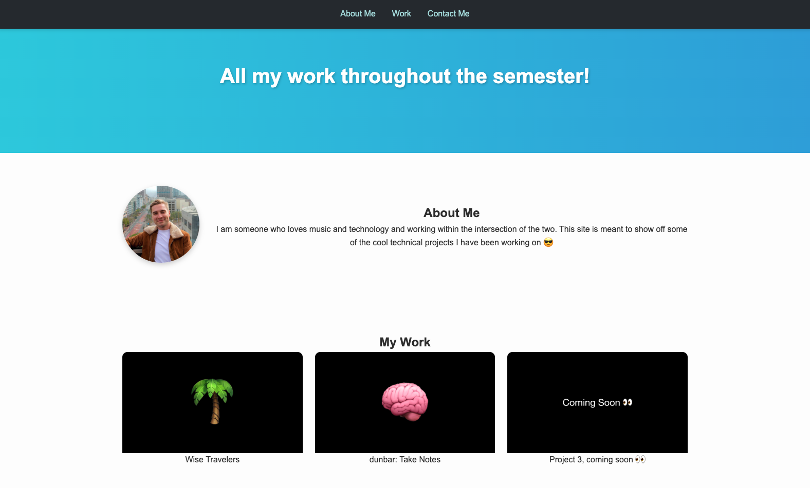

# Professional Portfolio

<div align="center">
  
</div>

## Description

Welcome to my professional portfolio! This site showcases the projects I have worked on throughout the semester and highlights my skills in web development. The portfolio is designed to be **modern**, **responsive**, and easy to navigate. It includes sections for my featured projects, a short introduction about me, and a contact section for easy collaboration.

---

## Table of Contents

1. [Features](#features)
2. [Technologies Used](#technologies-used)
3. [Usage](#usage)
4. [Links](#links)
5. [Credits](#credits)
6. [License](#license)

---

## Features

- **Hero Section**: A clean header with an introductory title.
- **About Me Section**: Includes a professional headshot/avatar and a short bio.
- **My Work Section**:
  - A **featured project** displayed prominently.
  - Two additional projects displayed evenly below the featured work.
  - Interactive hover effects for a polished user experience.
- **Responsive Design**: Fully functional on **desktop**, **tablet**, and **mobile devices**.
- **Contact Section**: Provides an email link for collaboration opportunities.

---

## Technologies Used

- **HTML5**: For the structure of the website.
- **CSS3**: For styling, layout, and responsiveness.
- **Flexbox & Grid**: Modern CSS techniques for clean and adaptive design.
- **Media Queries**: Ensures the site looks great on all screen sizes.

---

## Usage

To view the project locally:

1. Clone the repository to your local machine:

   ```bash
   git clone https://github.com/michaelpratt23/professional-portfolio.git

   ```

2. Navigate to the project folder:

   ```bash
   cd professional-portfolio

   ```

3. Open the `index.html` file in your browser to explore the site.

4. Alternatively, you can visit the **deployed live version** of the portfolio here:

   👉 [Live Portfolio](https://michaelpratt23.github.io/professional-portfolio/)

## Links

- **Live Site**: [https://michaelpratt23.github.io/professional-portfolio/](https://michaelpratt23.github.io/professional-portfolio/)
- **GitHub Repository**: [https://github.com/michaelpratt23/professional-portfolio](https://github.com/michaelpratt23/professional-portfolio)

---

## Credits

- Avatar Image: Personal photo.
- Icons and placeholders: Images used for demonstration purposes only.

---

## License

This project is licensed under the MIT License. See the [LICENSE](LICENSE) file for details.
